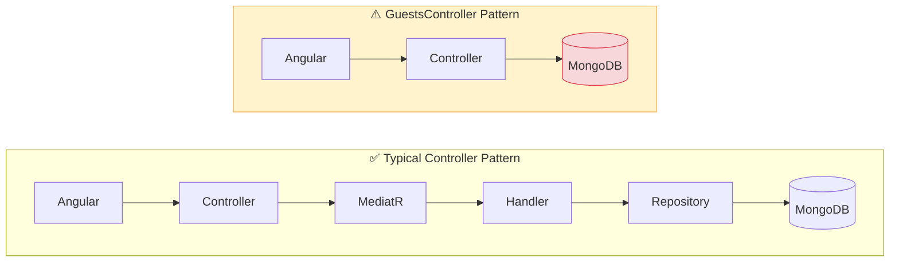
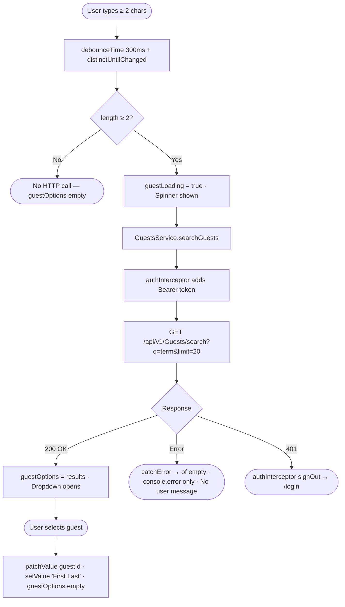
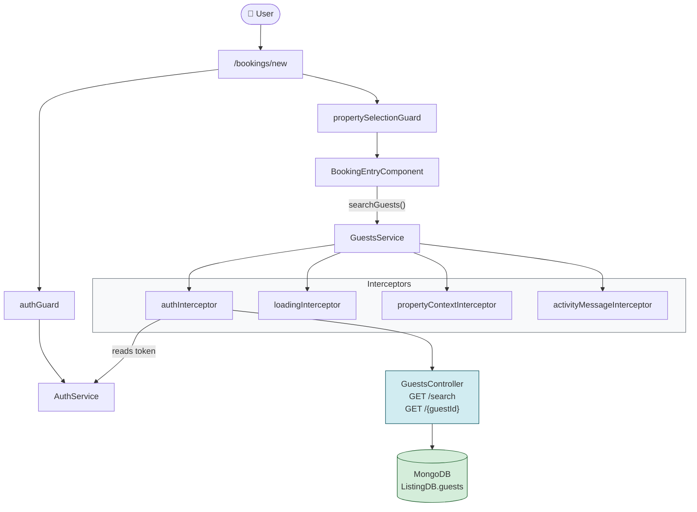
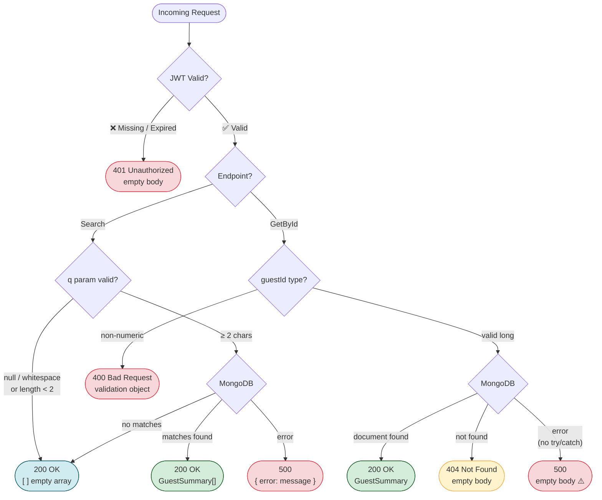
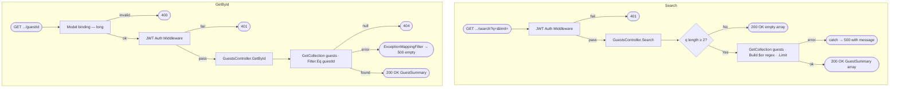
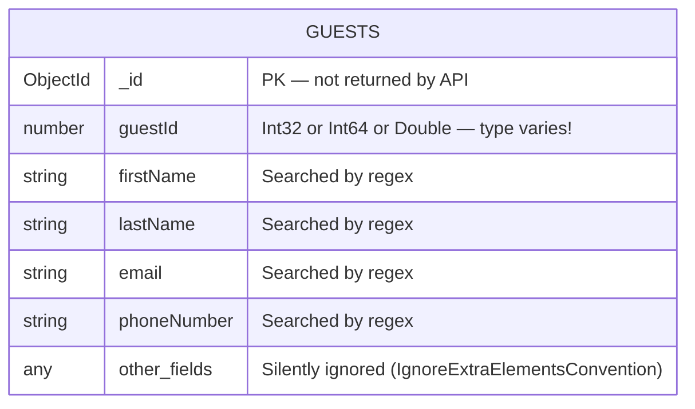
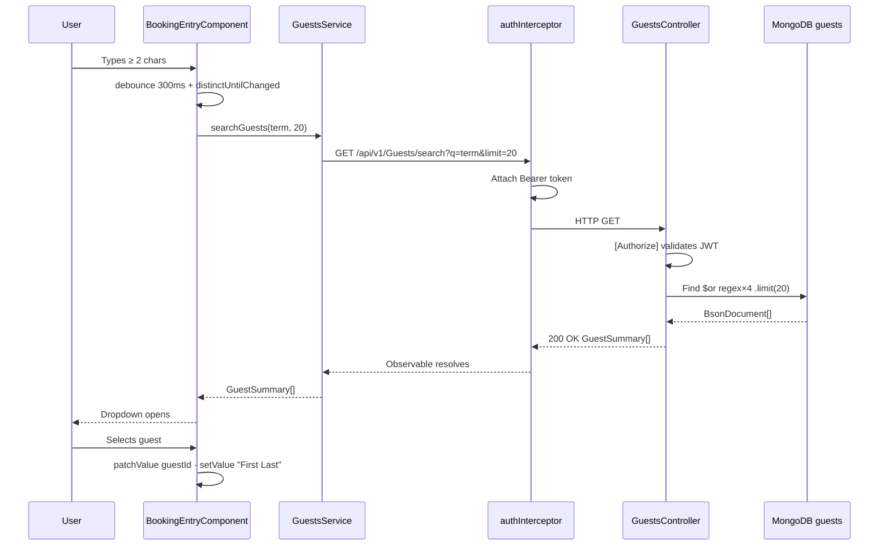

# DIAD — GuestsController
**Solution:** PropertyMasterLTD &nbsp;|&nbsp; **Analysed:** 2025-07-14 &nbsp;|&nbsp; **Source:** `WebApi/API/V1/GuestsController.cs`

---

## TL;DR

> **What it does:** Two read-only endpoints — `Search` queries the `guests` MongoDB collection by name, email, or phone using a case-insensitive regex; `GetById` fetches one guest by numeric ID.
>
> **Who calls it:** `Search` is called by `BookingEntryComponent` via `GuestsService` to power the guest autocomplete on `/bookings/new`. `GetById` is defined in `GuestsService` but **no Angular component currently calls it**.
>
> **Database:** Both hit `ListingDB.guests` directly via `IMongoDatabase` — **no repository, no MediatR, no DTO class**.
>
> **Top risks:** ⚠️ No indexes → full collection scan on every search. ⚠️ `GetById` has no try/catch → Mongo errors return an empty 500. ⚠️ `GetById` may return false 404 if `guestId` is stored as `Int32` instead of `Int64` in MongoDB.
>
> **Status:** `Search` ✅ active. `GetById` ⚠️ defined but unused in the UI.

---

## Table of Contents

- [1. Overview](#1-overview)
- [2. UI & Behaviour](#2-ui--behaviour)
- [3. Angular](#3-angular)
- [4. Parameters & Validation](#4-parameters--validation)
- [5. Responses & DTO](#5-responses--dto)
- [6. Business Rules](#6-business-rules)
- [7. Execution Flow](#7-execution-flow)
- [8. Files & Dependencies](#8-files--dependencies)
- [9. Database](#9-database)
- [10. Security, Logging & Config](#10-security-logging--config)
- [11. Impact & Failure](#11-impact--failure)
- [12. Testing](#12-testing)
- [13. Bugs & Troubleshooting](#13-bugs--troubleshooting)
- [14. Sequence Diagram](#14-sequence-diagram)
- [15. Decision Log](#15-decision-log)
- [16. Change Checklist](#16-change-checklist)

---

## 1. Overview

| | `Search` | `GetById` |
|---|---|---|
| **HTTP** | `GET api/v1/Guests/search` | `GET api/v1/Guests/{guestId}` |
| **Auth** | ✅ JWT Bearer `[Authorize]` | ✅ JWT Bearer `[Authorize]` |
| **Roles** | None | None |
| **Handler / Repo** | ❌ None — direct `IMongoDatabase` | ❌ None — direct `IMongoDatabase` |
| **Mongo Collection** | `ListingDB.guests` | `ListingDB.guests` |
| **Angular Service** | `GuestsService.searchGuests(query, limit?)` | `GuestsService.getGuestById(guestId)` |
| **Angular Component** | `BookingEntryComponent` | ⚠️ Not found — method defined, no caller |
| **Reads / Writes** | Read only | Read only |
| **Complexity** | ⚠️ O(n) — full regex scan, no index | ⚠️ O(n) — equality scan, no index |
| **What it does** | Case-insensitive regex search across `firstName`, `lastName`, `email`, `phoneNumber`. Returns up to `limit` results. | Fetches one guest document by numeric `guestId`. |
| **Business purpose** | Powers guest typeahead on Booking Entry. Prevents duplicate guests. Links bookings to known identities. | Targeted guest lookup when only `guestId` is known. |
| **Top risk** | Breaks autocomplete on `/bookings/new`; no indexes → slow on large data | No try/catch → generic 500; BSON Int32/Int64 mismatch → false 404 |

**Dev URLs**

| Env | Search | GetById |
|---|---|---|
| Dev | `https://localhost:44346/api/v1/Guests/search?q={term}&limit={n}` | `https://localhost:44346/api/v1/Guests/{guestId}` |
| Prod | `https://propertymaster-api-de09-...azurewebsites.net/api/v1/Guests/search` | `https://propertymaster-api-de09-...azurewebsites.net/api/v1/Guests/{guestId}` |

### Architecture Pattern

> ⚠️ This controller **skips the standard application layers**. Compare with the typical pattern used elsewhere in the project.



---

## 2. UI & Behaviour

### UI Features

| Endpoint | UI Element | Screen | Trigger |
|---|---|---|---|
| `Search` | Guest autocomplete input + dropdown | `/bookings/new` — Booking Entry | User types ≥ 2 characters |
| `GetById` | ⚠️ No active UI — service method exists but no component calls it | — | — |

> `BookingDetailsDialog` receives pre-resolved guest data — does **not** call this endpoint.

### `Search` Flow



| State | Behaviour |
|---|---|
| Loading | `guestLoading = true` → `MatProgressSpinner` |
| Success | Dropdown shows matching guests |
| Error | Silently empty dropdown — `console.error` only |
| No results | Empty dropdown — no user feedback |
| < 2 chars | Angular short-circuits — no HTTP call |
| Guest selected | `guestId` patched into booking form |
| Submit without guest | `Validators.required` shows form error |

---

## 3. Angular

| Type | Name | File | Detail |
|---|---|---|---|
| **Component** | `BookingEntryComponent` | `app/src/app/bookings/booking-entry/booking-entry.component.ts` | Hosts autocomplete; triggers search on value changes |
| **Service** | `GuestsService` | `app/src/app/services/guests.service.ts` | `searchGuests(query, limit?)`, `getGuestById(guestId)` |
| **Model** | `GuestSummary` | `app/src/app/services/guests.service.ts` | `{ guestId: number; firstName: string; lastName: string; email?: string; phoneNumber?: string; }` |
| **Route** | `/bookings/new` | `app/src/app/app.routes.ts` line 17 | Lazy-loaded; guarded by `authGuard`, `propertySelectionGuard` |
| **Guard** | `authGuard` | `app/src/app/core/auth/guards/auth.guard.ts` | Checks `AuthService.isSignedIn()` → redirects to `/login` |
| **Guard** | `propertySelectionGuard` | `app/src/app/core/auth/guards/property-selection.guard.ts` | Requires property selected before `/bookings/new` |
| **Interceptor** | `authInterceptor` | `app/src/app/core/auth/services/auth.interceptor.ts` | Attaches `Authorization: Bearer <token>`; on 401 → sign-out + `/login` |
| **Interceptor** | `loadingInterceptor` | `app/src/app/core/interceptors/loading.interceptor.ts` | Global loading state |
| **Interceptor** | `propertyContextInterceptor` | `app/src/app/core/interceptors/property-context.interceptor.ts` | Adds property context headers |
| **Interceptor** | `activityMessageInterceptor` | `app/src/app/core/interceptors/activity-message.interceptor.ts` | Activity tracking |
| **Env (Dev)** | `apiUrl` | `app/src/app/environments/environment.ts` | `https://localhost:44346/api/v1` |
| **Env (Prod)** | `apiUrl` | `app/src/app/environments/environment.prod.ts` | `https://propertymaster-api-de09-...azurewebsites.net/api/v1` |

### Angular Dependency Graph



---

## 4. Parameters & Validation

### Parameters

| Endpoint | Param | Type | Source | Nullable | Default | Validation |
|---|---|---|---|---|---|---|
| `Search` | `q` | `string` | `[FromQuery]` | ✅ Yes | — | Manual: `IsNullOrWhiteSpace` or `Length < 2` → `200 []` |
| `Search` | `limit` | `int` | `[FromQuery]` | ❌ No | `20` | None |
| `GetById` | `guestId` | `long` | `[FromRoute]` | ❌ No | — | Model binding — non-numeric → `400` |

> No DTO class, no FluentValidation, no repository validation — all validation is manual or framework-level.

### Validation Rules

| Endpoint | Rule | Where | Outcome |
|---|---|---|---|
| `Search` | `q` null or whitespace | `GuestsController.Search()` line 27 | `200 OK []` — not treated as error |
| `Search` | `q` trimmed length < 2 | `GuestsController.Search()` line 27 | `200 OK []` |
| `Search` | `q` trimmed length < 2 (Angular) | `booking-entry.component.ts` line 107 | RxJS short-circuits — no HTTP call |
| `GetById` | `guestId` must be valid `long` | ASP.NET model binding | `400 Bad Request` |
| `GetById` | Guest document must exist | `GuestsController.GetById()` | `404 Not Found` if null |

### Request Examples

| Scenario | Request |
|---|---|
| Minimum | `GET /api/v1/Guests/search?q=Jo` |
| Typical | `GET /api/v1/Guests/search?q=John%20Smith&limit=20` |
| 1-char (short-circuits) | `GET /api/v1/Guests/search?q=J` → `200 []` |
| Missing q | `GET /api/v1/Guests/search?limit=20` → `200 []` |
| No token | `GET /api/v1/Guests/search?q=John` → `401` |
| GetById — valid | `GET /api/v1/Guests/50000000000001` → `200 OK` |
| GetById — not found | `GET /api/v1/Guests/9999999` → `404` |
| GetById — invalid | `GET /api/v1/Guests/abc` → `400` |

---

## 5. Responses & DTO

### Error Response Map



### HTTP Status Map

| Scenario | `Search` | `GetById` |
|---|---|---|
| ✅ Success | `200 OK` — `GuestSummary[]` | `200 OK` — `GuestSummary` |
| ✅ No results / short q | `200 OK` — `[]` | — |
| ❌ Not found | — | `404 Not Found` — empty body |
| ❌ Invalid param | — | `400 Bad Request` — validation object |
| ❌ Unauthenticated | `401 Unauthorized` — empty body | `401 Unauthorized` — empty body |
| ❌ Mongo / server error | `500` — `{ "error": "<msg>" }` | `500` — empty body (no try/catch) |

### Response Shape — both endpoints return the same object

> No formal DTO. Both methods project to an anonymous object.

| Property | C# Type | BSON Type(s) | If Missing/Null | Helper |
|---|---|---|---|---|
| `guestId` | `long` | Int32 / Int64 / Double | `0` | `GetLong()` |
| `firstName` | `string` | String | `""` | `GetString()` |
| `lastName` | `string` | String | `""` | `GetString()` |
| `email` | `string` | String | `""` | `GetString()` |
| `phoneNumber` | `string` | String | `""` | `GetString()` |

**Angular `GuestSummary`** (`guests.service.ts`):
```typescript
export interface GuestSummary {
  guestId: number;
  firstName: string;
  lastName: string;
  email?: string;      // backend always returns ""
  phoneNumber?: string; // backend always returns ""
}
```

**Success responses:**
```json
// Search — 200 OK
[{ "guestId": 50000000000001, "firstName": "John", "lastName": "Smith", "email": "john.smith@example.com", "phoneNumber": "+44 7700 900000" }]

// GetById — 200 OK
{ "guestId": 50000000000001, "firstName": "John", "lastName": "Smith", "email": "john.smith@example.com", "phoneNumber": "+44 7700 900000" }

// Search — 500
{ "error": "A timeout occurred after 30000ms selecting a server..." }

// GetById — 400
{ "title": "One or more validation errors occurred.", "status": 400, "errors": { "guestId": ["The value 'abc' is not valid."] } }
```

---

## 6. Business Rules

| Rule | Implemented In | Impact if Removed |
|---|---|---|
| Query must be ≥ 2 chars before querying DB | `GuestsController.Search()` | Every keystroke fires a full collection scan |
| Search is case-insensitive | `BsonRegularExpression(..., "i")` | Users must type exact case |
| User input is regex-escaped | `Regex.Escape(q.Trim())` | Regex injection — `.*` would match all documents |
| Results capped by `limit` | `.Limit(limit)` | Unbounded results on large collections |
| Default limit is 20 | Method signature default | Clients must always supply `limit` |
| `GetById` returns 404 when not found | `if (doc == null) return NotFound()` | Angular gets `null` → likely crash |
| BSON numeric type ambiguity handled in projection | `GetLong()` switch on `BsonType` | `guestId` stored as Int32/Double returns `0` |
| Missing BSON fields return safe defaults | `GetString()` / `GetLong()` | `BsonSerializationException` or unexpected nulls |

---

## 7. Execution Flow



---

## 8. Files & Dependencies

### Source Files

| Artefact | Path |
|---|---|
| Controller | `WebApi/API/V1/GuestsController.cs` |
| Angular Service + Model | `app/src/app/services/guests.service.ts` |
| Angular Component | `app/src/app/bookings/booking-entry/booking-entry.component.ts` |
| Angular Routes | `app/src/app/app.routes.ts` |
| Exception Filter | `WebApi/ErrorHandling/Filters/ExceptionMappingFilter.cs` |
| Startup / DI | `WebApi/Startup.cs` |
| appsettings | `WebApi/appsettings.json` |
| DTO / Validator / Handler / Repository / AutoMapper | ❌ Not found — none exist for this controller |

### Backend Dependencies

| Dependency | Package | Lifetime | Role |
|---|---|---|---|
| `IMongoDatabase` | `MongoDB.Driver` | Scoped | Direct collection access |
| `IMongoClient` | `MongoDB.Driver` | Singleton | Underlying connection |
| `BsonDocument`, `BsonRegularExpression`, `BsonValue` | `MongoDB.Bson` | — | Query building & document reading |
| `Regex.Escape()` | `System.Text.RegularExpressions` | — | Sanitise user input |
| JWT Bearer Auth | ASP.NET Core / .NET 8 | — | Validates `[Authorize]` |
| `ExceptionMappingFilter` | Internal | Global filter | Exception → HTTP status mapping |

### Angular Dependencies

| Package | Used For |
|---|---|
| `HttpClient`, `HttpParams` | HTTP calls & query string construction |
| `debounceTime`, `distinctUntilChanged`, `switchMap` | Controlled search triggering |
| `catchError` | Silent error recovery |
| `MatAutocompleteModule` | Typeahead dropdown |
| `MatProgressSpinnerModule` | Loading indicator |

---

## 9. Database

### Collection: `guests` (database: `ListingDB`)

| Field | BSON Type | Returned | Notes |
|---|---|---|---|
| `_id` | ObjectId | ❌ No | Default Mongo ID — excluded from response |
| `guestId` | Int32 / Int64 / Double | ✅ Yes | Type varies per document — handled by `GetLong()` |
| `firstName` | String | ✅ Yes | |
| `lastName` | String | ✅ Yes | |
| `email` | String | ✅ Yes | |
| `phoneNumber` | String | ✅ Yes | |
| *(other fields)* | Various | ❌ No | Ignored via `IgnoreExtraElementsConvention` |

### Document Schema Diagram



> ⚠️ **Index gap:** All four searched fields (`firstName`, `lastName`, `email`, `phoneNumber`) have **no indexes**. Every search is a `COLLSCAN` — performance degrades linearly with collection size.

**Indexes:** ❌ None found — all queries are full collection scans (`COLLSCAN`).  
**Aggregation / Lookups / Sort / Pagination:** ❌ Not used.

### Queries

**Search:**
```javascript
db.guests.find({
  $or: [
	{ firstName:   { $regex: "<Regex.Escape(q)>", $options: "i" } },
	{ lastName:    { $regex: "<Regex.Escape(q)>", $options: "i" } },
	{ email:       { $regex: "<Regex.Escape(q)>", $options: "i" } },
	{ phoneNumber: { $regex: "<Regex.Escape(q)>", $options: "i" } }
  ]
}).limit(20)
```

**GetById:**
```javascript
db.guests.findOne({ guestId: <guestId> })  // BsonValue.Create(long) — matches by exact BSON type
```

### Read / Write Summary

| Endpoint | Collection | Read | Write | Cache | Events |
|---|---|---|---|---|---|
| `Search` | `guests` | ✅ Find + Limit | ❌ | ❌ | ❌ |
| `GetById` | `guests` | ✅ FindOne | ❌ | ❌ | ❌ |

---

## 10. Security, Logging & Config

### Security

| Area | Status | Detail |
|---|---|---|
| Authentication | ✅ Required | `[Authorize]` class-level — JWT Bearer |
| Role authorization | ⚠️ None | Any authenticated user can call both endpoints |
| Regex injection | ✅ Protected | `Regex.Escape(q.Trim())` applied |
| NoSQL injection | ✅ Protected | BSON filter builders — no string interpolation |
| PII | ⚠️ Unmasked | `email` and `phoneNumber` returned in full — no redaction |
| Rate limiting | ❌ None | Not configured |
| CORS | ✅ Configured | `localhost:4200`, Vercel URLs, Azure URL — see `appsettings.json:CorsSettings` |
| Token expiry | ✅ 24 h | Angular interceptor auto signs-out on 401 |

### Logging

| Location | Message | Method |
|---|---|---|
| `GuestsController.Search()` catch | `"GuestsController.Search error: {ex.Message}"` | ⚠️ `Console.WriteLine` — not `ILogger` |
| `GuestsController.GetById()` | ❌ Nothing — no try/catch, no logger | — |

> ⚠️ `Console.WriteLine` does not appear in Azure Application Insights unless stdout is explicitly captured.

### Configuration

| Key | File | Value | Required |
|---|---|---|---|
| `AppSettings:MongoDbDatabaseName` | `appsettings.json` | `"ListingDB"` | ✅ |
| `ConnectionStrings:MongoDb` | Azure App Settings | `<AZURE_MONGODB_CONNECTION_STRING>` | ✅ |
| `AuthenticationSettings:JwtSigningKeyBase64` | Azure App Settings | `<SET_VIA_AZURE_APP_SETTINGS>` | ✅ |
| `AuthenticationSettings:JwtIssuer` | `appsettings.json` | `"MyWarehouse"` | ✅ |
| `AuthenticationSettings:TokenExpirationSeconds` | `appsettings.json` | `86400` (24 h) | ✅ |
| `SwaggerSettings:UseSwagger` | `appsettings.json` | `false` in prod | No |
| Angular `environment.apiUrl` | `environment.ts` / `environment.prod.ts` | Dev: `localhost:44346/api/v1` | ✅ |

---

## 11. Impact & Failure

### Impact if Changed

| Changed Endpoint | Affected File | Impact |
|---|---|---|
| `Search` route or response | `GuestsService.searchGuests()` | Must update URL / params |
| `Search` response shape | `GuestSummary` interface | Must stay in sync |
| `Search` any change | `BookingEntryComponent` | Guest autocomplete breaks → `guestId` cannot be set → booking submission fails |
| `GetById` route | `GuestsService.getGuestById()` | Must update URL |
| Either — `guests` collection schema | `DashboardController` / `DashboardService.getBookingsWithGuests()` | Queries same collection independently |

### Failure Behaviour

| Failure | `Search` | `GetById` |
|---|---|---|
| MongoDB unavailable / timeout | `catch` → `500 { "error": "..." }` | No try/catch → `ExceptionMappingFilter` → `500` empty body |
| No / invalid JWT | `401 Unauthorized` | `401 Unauthorized` |
| `q` < 2 chars | `200 []` | — |
| `guestId` non-numeric | — | `400 Bad Request` |
| Guest not found | `200 []` (no "not found" concept) | `404 Not Found` |
| BSON type mismatch on `guestId` | Not affected (string fields) | May return `404` on valid ID |

---

## 12. Testing

### Postman / HTTP

```http
# 1. Get token
POST /api/v1/account/oauth2/access_token
{ "email": "...", "password": "..." }

# 2. Search
GET /api/v1/Guests/search?q=John&limit=5
Authorization: Bearer <token>

# 3. GetById
GET /api/v1/Guests/50000000000001
Authorization: Bearer <token>
```

### Angular UI Steps

| Step | Action | Expected |
|---|---|---|
| 1 | Login → select property → `/bookings/new` | Booking Entry form loads |
| 2 | Type ≥ 2 chars in Guest field | Dropdown appears after 300ms |
| 3 | Select a guest | Input shows "First Last"; `guestId` set in form |
| 4 | Submit without selecting guest | Form validation error on guest field |

### MongoDB Compass

```javascript
// Search verification
db.guests.find({ $or: [{ firstName: { $regex: "John", $options: "i" } }, { lastName: { $regex: "John", $options: "i" } }] }).limit(5)
// GetById verification
db.guests.findOne({ guestId: 50000000000001 })
// Check BSON type of guestId
db.guests.findOne({ guestId: { $exists: true } }, { guestId: 1 })
```

### Test Cases

| # | Category | Method | Input | Expected |
|---|---|---|---|---|
| TC-01 | ✅ Happy | Search | `q=John` | `200` — matches on firstName |
| TC-02 | ✅ Happy | Search | `q=john@example.com` | `200` — email match |
| TC-03 | ✅ Happy | Search | `q=+44` | `200` — phone match |
| TC-04 | ✅ Happy | GetById | Valid `guestId` | `200` — single object |
| TC-05 | 🔲 Boundary | Search | `q=Jo` (exactly 2) | `200` — results if any |
| TC-06 | 🔲 Boundary | Search | `q=J` (1 char) | `200 []` |
| TC-07 | 🔲 Boundary | Search | `q=   ` (whitespace) | `200 []` |
| TC-08 | 🔲 Boundary | Search | `q=John&limit=1` | `200` — max 1 result |
| TC-09 | 🔲 Boundary | Search | `q=John&limit=0` | `200 []` |
| TC-10 | ❌ Invalid | GetById | `guestId=abc` | `400` |
| TC-11 | ❌ Not found | GetById | `guestId=9999999` | `404` |
| TC-12 | 🔒 Security | Search | No `Authorization` header | `401` |
| TC-13 | 🔒 Security | Search | `q=.*` (regex inject) | `200` — escaped to `\.\*` |
| TC-14 | 🔒 Security | Search | Expired JWT | `401` |
| TC-15 | ⚡ Perf | Search | `q=a` (many matches) | `200` — capped at `limit` |
| TC-16 | ⚡ Concurrency | Search | Rapid keystrokes | Only last resolves (`switchMap`) |
| TC-17 | 🔡 Case | Search | `q=JOHN` vs `q=john` | Same results |

---

## 13. Bugs & Troubleshooting

### Known Bugs

| # | Bug | Where | Severity |
|---|---|---|---|
| BUG-01 | BSON type mismatch — `BsonValue.Create(long)` sends `Int64`; if stored as `Int32`/`Double` → false `404` | `GetById` | 🔴 High |
| BUG-02 | No try/catch in `GetById` — Mongo error → generic `500` with empty body, no diagnostic | `GetById` | 🔴 High |
| BUG-03 | `Console.WriteLine` not `ILogger` — errors invisible to App Insights | `Search` | 🟡 Medium |
| BUG-04 | Silent Angular search failure — `catchError` returns `[]`, no user message | `BookingEntryComponent` | 🟡 Medium |
| BUG-05 | No sort on Search results — insertion order, non-deterministic on busy collections | `Search` | 🟢 Low |
| BUG-06 | `limit=0` accepted — returns 0 results silently | `Search` | 🟢 Low |
| BUG-07 | Document with missing `guestId` field returns `guestId: 0` — misleading | `GetLong()` helper | 🟢 Low |

### Troubleshooting

| Problem | Steps |
|---|---|
| **401 on all requests** | 1. Check `Authorization` header in Network tab. 2. Verify token not expired. 3. Confirm `authInterceptor` is in `app.config.ts`. 4. Check `JwtSigningKeyBase64` in Azure App Settings. |
| **Search returns `[]` unexpectedly** | 1. Is a request firing? (If not → query < 2 chars). 2. Run shell query in Compass. 3. Confirm BSON field names are lowercase (`firstName` not `FirstName`). |
| **GetById returns 404 on valid ID** | 1. `db.guests.findOne({ guestId: <id> })` in Compass. 2. Check BSON type. 3. Try: `{ guestId: { $in: [NumberInt(<id>), NumberLong(<id>)] } }`. |
| **Autocomplete not appearing** | 1. Check Network tab — is `Guests/search` firing? 2. Console errors? 3. `environment.apiUrl` matches backend? 4. Typed ≥ 2 chars and waited 300ms? |
| **500 on Search** | Check stdout / Azure Log Stream. Check `ConnectionStrings:MongoDb`. Reproduce in Compass. |
| **500 empty body on GetById** | Add try/catch temporarily. Check Mongo connectivity. Check BSON type mismatch (BUG-01). |

---

## 14. Sequence Diagram



---

## 15. Decision Log

| Decision | Reason | Where | Risk if Reversed |
|---|---|---|---|
| Direct `IMongoDatabase` — no repository | Not found in project | Constructor injection | Cannot unit test without real MongoDB |
| Anonymous object — no DTO | Not found in project | Both projection blocks | Response contract not compile-time safe |
| Min 2-char guard | Prevents expensive full-scan on short terms | `GuestsController.Search()` | Every keystroke hits MongoDB |
| `Regex.Escape()` | Prevents regex injection | `GuestsController.Search()` | `.*` matches all documents |
| `switchMap` in Angular | Cancels prior requests on new keystroke | `BookingEntryComponent.ngOnInit()` | Race conditions, stale dropdown results |
| `Console.WriteLine` for errors | Not found — likely oversight | `Search` catch block | Invisible in structured logging |
| No try/catch in `GetById` | Not found — possibly intentional delegation to global filter | `GuestsController.GetById()` | Empty 500 with no diagnostic info |

---

## 16. Change Checklist

**Before modifying this controller or any related file:**

**Route / contract changes**
- [ ] `GuestsService` URL or method signature updated
- [ ] `GuestSummary` interface matches new response shape
- [ ] `BookingEntryComponent` autocomplete still works end-to-end

**MongoDB changes**
- [ ] Field names match collection exactly (case-sensitive)
- [ ] BSON type ambiguity handled for numeric fields
- [ ] Query tested in MongoDB Compass before deploying

**Error handling**
- [ ] `GetById` has try/catch matching `Search`
- [ ] Errors logged via `ILogger`, not `Console.WriteLine`

**Performance**
- [ ] Indexes considered for any new search fields
- [ ] `Regex.Escape()` applied to all user-supplied params
- [ ] `Limit()` still applied

**Security**
- [ ] `[Authorize]` attribute retained
- [ ] PII handling reviewed if new fields are added

**Deployment**
- [ ] `ConnectionStrings:MongoDb` in Azure App Settings (not committed)
- [ ] `JwtSigningKeyBase64` in Azure App Settings
- [ ] CORS `AllowedOrigins` includes deployment URL

---
*GuestsController · `Search` + `GetById` · `GET api/v1/Guests/search` · `GET api/v1/Guests/{guestId}`*
