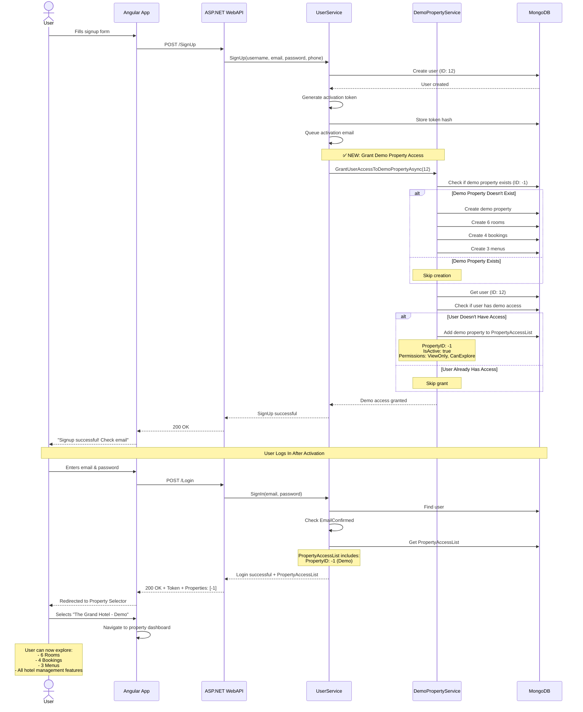

# Demo Property System - Technical Documentation

## Overview

The Demo Property System automatically creates and assigns a **shared demonstration property** to all new users upon signup. This provides an instant, hands-on experience of the PropertyMaster hotel management system without requiring users to set up their own property first.

---

## Table of Contents

- [Architecture](#architecture)
- [Database Schema](#database-schema)
- [Implementation Details](#implementation-details)
- [User Flow](#user-flow)
- [Configuration](#configuration)
- [Testing](#testing)
- [Future Enhancements](#future-enhancements)

---

## Architecture

### System Components

```
┌────────────────────┐
│   User Signs Up    │
└─────────┬──────────┘
          │
          ▼
┌────────────────────┐
│  UserService       │
│  .SignUp()         │
└─────────┬──────────┘
          │
          ├────────────────────┐
          │                    │
          ▼                    ▼
┌──────────────────┐  ┌───────────────────┐
│ Create User      │  │ DemoPropertySvc   │
│ in MongoDB       │  │ .GrantAccess()    │
└──────────────────┘  └────────┬──────────┘
                               │
                               ▼
                      ┌─────────────────────┐
                      │ Ensure Demo         │
                      │ Property Exists     │
                      └────────┬────────────┘
                               │
                               ├─────────────────┐
                               │                 │
                               ▼                 ▼
                      ┌────────────┐    ┌────────────┐
                      │  Property  │    │  Bookings  │
                      │  (ID: -1)  │    │  Menus     │
                      └────────────┘    └────────────┘
                               │
                               ▼
                      ┌─────────────────────┐
                      │ Add Property to     │
                      │ User's AccessList   │
                      └─────────────────────┘
```

---

## Database Schema

### 1. Demo Property

**Collection:** `Properties`  
**ID:** `-1` (Special negative ID to distinguish from user-created properties)

```javascript
{
  "_id": -1,
  "Name": "The Grand Hotel - Demo",
  "Active": true,
  "PropertyCode": "DEMO0001",
  "CompanyLogoURL": "https://placehold.co/200x200/4CAF50/white?text=DEMO",
  "Rooms": [
    {
      "_id": "room-101",
      "RoomCode": "101",
      "RoomName": "Deluxe King Room",
      "Active": true,
      "CompanyLogoURL": "https://placehold.co/400x300/2196F3/white?text=Room+101"
    },
    {
      "_id": "room-102",
      "RoomCode": "102",
      "RoomName": "Deluxe Queen Room",
      "Active": true,
      "CompanyLogoURL": "https://placehold.co/400x300/2196F3/white?text=Room+102"
    },
    {
      "_id": "room-201",
      "RoomCode": "201",
      "RoomName": "Executive Suite",
      "Active": true,
      "CompanyLogoURL": "https://placehold.co/400x300/9C27B0/white?text=Suite+201"
    },
    {
      "_id": "room-202",
      "RoomCode": "202",
      "RoomName": "Presidential Suite",
      "Active": true,
      "CompanyLogoURL": "https://placehold.co/400x300/9C27B0/white?text=Suite+202"
    },
    {
      "_id": "room-301",
      "RoomCode": "301",
      "RoomName": "Family Room",
      "Active": true,
      "CompanyLogoURL": "https://placehold.co/400x300/FF9800/white?text=Family+301"
    },
    {
      "_id": "room-302",
      "RoomCode": "302",
      "RoomName": "Ocean View Room",
      "Active": true,
      "CompanyLogoURL": "https://placehold.co/400x300/00BCD4/white?text=Ocean+302"
    }
  ],
  "CreatedAt": "2024-03-10T00:00:00Z",
  "IsDemo": true  // Flag to identify demo property
}
```

### 2. Demo Bookings

**Collection:** `Bookings`  
**PropertyID:** `-1`

```javascript
[
  // Past booking - Completed
  {
    "_id": -1,
    "PropertyID": -1,
    "RoomCode": "101",
    "GuestName": "John Smith",
    "GuestEmail": "john.smith@example.com",
    "CheckIn": "2024-02-28T14:00:00Z",  // 10 days ago
    "CheckOut": "2024-03-03T11:00:00Z",  // 7 days ago
    "Status": "Completed",
    "TotalAmount": 450.00,
    "CreatedAt": "2024-02-23T10:00:00Z",
    "IsDemo": true
  },
  
  // Current booking - Active
  {
    "_id": -2,
    "PropertyID": -1,
    "RoomCode": "201",
    "GuestName": "Sarah Johnson",
    "GuestEmail": "sarah.j@example.com",
    "CheckIn": "2024-03-08T14:00:00Z",  // 2 days ago
    "CheckOut": "2024-03-12T11:00:00Z",  // 2 days from now
    "Status": "Active",
    "TotalAmount": 800.00,
    "CreatedAt": "2024-03-05T15:30:00Z",
    "IsDemo": true
  },
  
  // Future booking - Confirmed
  {
    "_id": -3,
    "PropertyID": -1,
    "RoomCode": "302",
    "GuestName": "Michael Brown",
    "GuestEmail": "m.brown@example.com",
    "CheckIn": "2024-03-15T14:00:00Z",  // 5 days from now
    "CheckOut": "2024-03-22T11:00:00Z",  // 12 days from now
    "Status": "Confirmed",
    "TotalAmount": 1200.00,
    "CreatedAt": "2024-03-07T09:15:00Z",
    "IsDemo": true
  },
  
  // Future booking - Pending
  {
    "_id": -4,
    "PropertyID": -1,
    "RoomCode": "102",
    "GuestName": "Emma Davis",
    "GuestEmail": "emma.davis@example.com",
    "CheckIn": "2024-03-20T14:00:00Z",  // 10 days from now
    "CheckOut": "2024-03-24T11:00:00Z",  // 14 days from now
    "Status": "Pending",
    "TotalAmount": 600.00,
    "CreatedAt": "2024-03-10T12:00:00Z",
    "IsDemo": true
  }
]
```

### 3. Demo Menus

**Collection:** `Menus`  
**PropertyID:** `-1`

```javascript
[
  // Breakfast Menu
  {
    "_id": -1,
    "PropertyID": -1,
    "MenuName": "Breakfast Menu",
    "MenuType": "Breakfast",
    "Active": true,
    "AvailableFrom": "06:00",
    "AvailableTo": "11:00",
    "Items": [
      {
        "ItemName": "Continental Breakfast",
        "Description": "Croissant, jam, butter, coffee/tea",
        "Price": 12.99,
        "Category": "Breakfast",
        "Available": true
      },
      {
        "ItemName": "Full English Breakfast",
        "Description": "Eggs, bacon, sausage, beans, toast",
        "Price": 18.99,
        "Category": "Breakfast",
        "Available": true
      },
      {
        "ItemName": "Pancake Stack",
        "Description": "Stack of 3 with maple syrup",
        "Price": 14.99,
        "Category": "Breakfast",
        "Available": true
      }
    ],
    "CreatedAt": "2024-03-10T00:00:00Z",
    "IsDemo": true
  },
  
  // Lunch Menu
  {
    "_id": -2,
    "PropertyID": -1,
    "MenuName": "Lunch Menu",
    "MenuType": "Lunch",
    "Active": true,
    "AvailableFrom": "12:00",
    "AvailableTo": "15:00",
    "Items": [
      {
        "ItemName": "Caesar Salad",
        "Description": "Romaine lettuce, parmesan, croutons",
        "Price": 16.99,
        "Category": "Salads",
        "Available": true
      },
      {
        "ItemName": "Grilled Chicken Sandwich",
        "Description": "With fries and coleslaw",
        "Price": 19.99,
        "Category": "Sandwiches",
        "Available": true
      },
      {
        "ItemName": "Fish & Chips",
        "Description": "Battered cod with chunky chips",
        "Price": 22.99,
        "Category": "Mains",
        "Available": true
      }
    ],
    "CreatedAt": "2024-03-10T00:00:00Z",
    "IsDemo": true
  },
  
  // Dinner Menu
  {
    "_id": -3,
    "PropertyID": -1,
    "MenuName": "Dinner Menu",
    "MenuType": "Dinner",
    "Active": true,
    "AvailableFrom": "18:00",
    "AvailableTo": "22:00",
    "Items": [
      {
        "ItemName": "Ribeye Steak",
        "Description": "12oz ribeye with vegetables",
        "Price": 34.99,
        "Category": "Steaks",
        "Available": true
      },
      {
        "ItemName": "Grilled Salmon",
        "Description": "Atlantic salmon with lemon butter",
        "Price": 28.99,
        "Category": "Seafood",
        "Available": true
      },
      {
        "ItemName": "Vegetarian Pasta",
        "Description": "Penne with roasted vegetables",
        "Price": 22.99,
        "Category": "Pasta",
        "Available": true
      }
    ],
    "CreatedAt": "2024-03-10T00:00:00Z",
    "IsDemo": true
  }
]
```

### 4. User Property Access

**Collection:** `Users`  
**Field:** `PropertyAccessList`

```javascript
{
  "_id": 12,  // User ID
  "UserName": "johndoe",
  "Email": "john@example.com",
  // ... other user fields
  "PropertyAccessList": [
    {
      "PropertyID": -1,  // Demo property
      "IsActive": true,
      "From": "2024-03-10T14:00:00Z",
      "To": "2025-03-10T14:00:00Z",  // 1 year access
      "CreatedDate": "2024-03-10T14:00:00Z",
      "CreatedBy": 12,
      "IsDemo": true,  // Flag to identify demo access
      "Permissions": ["ViewOnly", "CanExplore"]  // Limited permissions
    }
  ]
}
```

---

## Implementation Details

### 1. DemoPropertyService

**File:** `classfiles/Infrastructure/Services/DemoPropertyService.cs`

#### Key Methods:

```csharp
public async Task<int> EnsureDemoPropertyExistsAsync()
```
- **Purpose:** Ensures demo property exists in database
- **Behavior:** 
  - Checks if demo property with ID `-1` exists
  - If not, creates property with 6 rooms
  - Creates 4 sample bookings (past, current, future)
  - Creates 3 restaurant menus (breakfast, lunch, dinner)
- **Returns:** Demo property ID (`-1`)
- **Called:** On first user signup or API startup

```csharp
public async Task<bool> GrantUserAccessToDemoPropertyAsync(int userId)
```
- **Purpose:** Grants user access to demo property
- **Behavior:**
  - Calls `EnsureDemoPropertyExistsAsync()` first
  - Checks if user already has demo access
  - If not, adds demo property to user's `PropertyAccessList`
  - Sets 1-year access duration
  - Adds limited permissions (`ViewOnly`, `CanExplore`)
- **Returns:** `true` if successful, `false` otherwise
- **Called:** After successful user creation in `UserService.SignUp()`

#### Error Handling:

```csharp
try
{
    await _demoPropertyService.GrantUserAccessToDemoPropertyAsync(userId);
}
catch (Exception ex)
{
    _logger.LogError(ex, "Error granting demo property access");
    // Don't fail signup if demo property access fails
}
```

**Rationale:** Demo property failure should not prevent user registration.

---

### 2. UserService Integration

**File:** `classfiles/Infrastructure/Authentication/Core/Services/UserService.cs`

#### Constructor Injection:

```csharp
public UserService(
    // ... other dependencies
    IDemoPropertyService demoPropertyService)
{
    _demoPropertyService = demoPropertyService;
}
```

#### SignUp Method Enhancement:

```csharp
public async Task<(SignUpResult, SignUpResultData?)> SignUp(...)
{
    // 1. Create user
    var userId = await _mediator.Send(createUserCommand);
    
    // 2. Generate activation token
    // ...
    
    // 3. Queue activation email
    await _emailQueueService.QueueEmailAsync(...);
    
    // 4. ✅ NEW: Grant demo property access
    try
    {
        var demoAccessGranted = await _demoPropertyService
            .GrantUserAccessToDemoPropertyAsync(userId);
            
        if (demoAccessGranted)
        {
            _logger.LogInformation("Demo property access granted to user {UserId}", userId);
        }
    }
    catch (Exception ex)
    {
        _logger.LogError(ex, "Failed to grant demo property access to user {UserId}", userId);
        // Continue - don't fail signup
    }
    
    return (SignUpResult.Success, new SignUpResultData { UserId = userId, Email = email });
}
```

---

### 3. Dependency Injection Registration

**File:** `WebApi/Startup.cs`

```csharp
public void ConfigureServices(IServiceCollection services)
{
    // ... other services
    
    // Register Email Queue Service
    services.AddScoped<IEmailQueueService, EmailQueueService>();
    
    // ✅ NEW: Register Demo Property Service
    services.AddScoped<IDemoPropertyService, DemoPropertyService>();
    
    // ...
}
```

---

## User Flow

### Complete Flow Diagram



---

## Configuration

### Constants

```csharp
// classfiles/Infrastructure/Services/DemoPropertyService.cs

private const int DEMO_PROPERTY_ID = -1;
private const string DEMO_PROPERTY_NAME = "The Grand Hotel - Demo";
private const string DEMO_PROPERTY_CODE = "DEMO0001";
```

**Why negative ID?**
- Distinguishes demo data from user-created data
- Easy to filter in queries: `PropertyID >= 0` for user properties
- Prevents ID conflicts with auto-increment

### Access Duration

```csharp
{ "To", DateTime.UtcNow.AddYears(1) }  // 1 year demo access
```

**Configurable:** Can be changed to:
- Permanent: `DateTime.MaxValue`
- Limited trial: `DateTime.UtcNow.AddDays(30)` (30 days)
- Custom: `DateTime.UtcNow.AddMonths(6)` (6 months)

### Permissions

```csharp
{ "Permissions", new BsonArray { "ViewOnly", "CanExplore" } }
```

**Current:**
- `ViewOnly`: Read-only access
- `CanExplore`: Can navigate all sections

**Future:**
- `CanModify`: Edit demo data (isolated per user)
- `CanCreate`: Create sample bookings
- `CanDelete`: Delete sample data

---

## Testing

### Manual Testing

#### 1. Test Demo Property Creation

```bash
# Sign up a new user
curl -X POST https://localhost:44346/api/v1/account/SignUp \
  -H "Content-Type: application/json" \
  -d '{
    "username": "testuser",
    "email": "test@example.com",
    "password": "Test1234",
    "phone": "+1234567890"
  }'
```

#### 2. Verify Demo Property in MongoDB

```javascript
// Check demo property exists
db.Properties.findOne({ _id: -1 })

// Should return:
{
  "_id": -1,
  "Name": "The Grand Hotel - Demo",
  "PropertyCode": "DEMO0001",
  "Rooms": [ /* 6 rooms */ ],
  "IsDemo": true
}

// Check demo bookings
db.Bookings.find({ PropertyID: -1 }).count()
// Should return: 4

// Check demo menus
db.Menus.find({ PropertyID: -1 }).count()
// Should return: 3
```

#### 3. Verify User Has Demo Access

```javascript
// Find user
db.Users.findOne({ Email: "test@example.com" })

// Check PropertyAccessList
{
  "PropertyAccessList": [
    {
      "PropertyID": -1,
      "IsActive": true,
      "IsDemo": true,
      "Permissions": ["ViewOnly", "CanExplore"]
    }
  ]
}
```

#### 4. Test Login Returns Demo Property

```bash
# Login
curl -X POST https://localhost:44346/api/v1/account/login \
  -H "Content-Type: application/json" \
  -d '{
    "username": "test@example.com",
    "password": "Test1234"
  }'

# Response should include:
{
  "propertyAccessList": [-1],  // Demo property ID
  "accessToken": "...",
  // ...
}
```

### Unit Tests

```csharp
[Fact]
public async Task EnsureDemoPropertyExists_Should_Create_Once()
{
    // Arrange
    var service = GetDemoPropertyService();
    
    // Act
    var id1 = await service.EnsureDemoPropertyExistsAsync();
    var id2 = await service.EnsureDemoPropertyExistsAsync();
    
    // Assert
    Assert.Equal(-1, id1);
    Assert.Equal(-1, id2);
    
    // Verify only one property created
    var count = await GetPropertyCount(id: -1);
    Assert.Equal(1, count);
}

[Fact]
public async Task GrantUserAccess_Should_Add_To_PropertyAccessList()
{
    // Arrange
    var userId = await CreateTestUser();
    var service = GetDemoPropertyService();
    
    // Act
    var granted = await service.GrantUserAccessToDemoPropertyAsync(userId);
    
    // Assert
    Assert.True(granted);
    
    var user = await GetUser(userId);
    Assert.Contains(user.PropertyAccessList, p => p.PropertyID == -1);
}

[Fact]
public async Task GrantUserAccess_Should_Not_Duplicate()
{
    // Arrange
    var userId = await CreateTestUser();
    var service = GetDemoPropertyService();
    
    // Act
    await service.GrantUserAccessToDemoPropertyAsync(userId);
    await service.GrantUserAccessToDemoPropertyAsync(userId); // Second call
    
    // Assert
    var user = await GetUser(userId);
    var demoAccessCount = user.PropertyAccessList.Count(p => p.PropertyID == -1);
    Assert.Equal(1, demoAccessCount); // Should only have one entry
}
```

### Integration Tests

```csharp
[Fact]
public async Task SignUp_Should_Grant_Demo_Property_Access()
{
    // Arrange
    var userService = GetUserService();
    
    // Act
    var (result, data) = await userService.SignUp(
        "testuser", 
        "test@example.com", 
        "Test1234", 
        "+1234567890"
    );
    
    // Assert
    Assert.Equal(SignUpResult.Success, result);
    
    var user = await GetUserFromDatabase(data.UserId);
    Assert.NotNull(user.PropertyAccessList);
    Assert.Contains(user.PropertyAccessList, p => p.PropertyID == -1 && p.IsDemo);
}
```

---

## Monitoring & Logging

### Key Log Messages

```csharp
// Demo property creation
_logger.LogInformation("Demo property created successfully with ID {PropertyId}", -1);
_logger.LogInformation("Created {Count} demo bookings", 4);
_logger.LogInformation("Created {Count} demo menus with items", 3);

// User access grant
_logger.LogInformation("Demo property access granted to user {UserId}", userId);
_logger.LogWarning("User {UserId} already has access to demo property", userId);
_logger.LogError(ex, "Failed to grant user {UserId} access to demo property", userId);
```

### Metrics to Track

- **Demo property creation count**: Should be 1
- **Users with demo access**: Should match total signups
- **Demo property access failures**: Should be 0 or very low
- **Time to grant demo access**: Should be < 500ms

### Application Insights Queries

```kusto
// Count users with demo property access
traces
| where message contains "Demo property access granted"
| summarize count() by bin(timestamp, 1d)

// Track demo property access failures
exceptions
| where outerMessage contains "Failed to grant demo property access"
| project timestamp, userId = customDimensions.UserId, message

// Monitor demo property creation
traces
| where message contains "Demo property created"
| project timestamp, propertyId = customDimensions.PropertyId
```

---

## Future Enhancements

### 1. User-Specific Demo Data Isolation

**Current:** All users share the same demo bookings/menus  
**Future:** Each user gets a copy of demo data they can modify

```csharp
// Create user-specific demo property
var demoPropertyId = $"-{userId}";  // e.g., "-12" for user 12
```

**Benefits:**
- Users can experiment without affecting others
- Better learning experience

**Tradeoffs:**
- More storage required
- More complex cleanup

### 2. Demo Data Refresh

**Feature:** Allow users to reset demo data to original state

```csharp
public async Task ResetDemoDataAsync(int userId)
{
    // Delete user's demo modifications
    // Restore original bookings/menus
}
```

### 3. Demo Property Analytics

**Feature:** Track what users do in demo property

```csharp
public class DemoPropertyAnalytics
{
    public int UserId { get; set; }
    public int ViewCount { get; set; }
    public List<string> ViewedSections { get; set; }  // ["Bookings", "Menus", "Rooms"]
    public DateTime FirstAccess { get; set; }
    public DateTime LastAccess { get; set; }
}
```

**Use Cases:**
- Understand which features users explore most
- Identify drop-off points
- Improve onboarding flow

### 4. Guided Tour Integration

**Feature:** Interactive tutorial in demo property

```typescript
// Frontend: Guided tour steps
const demoTourSteps = [
  { target: '#bookings', content: 'View your upcoming bookings here' },
  { target: '#menus', content: 'Manage your restaurant menus' },
  { target: '#rooms', content: 'See all your available rooms' }
];
```

### 5. Demo Property Customization

**Feature:** Admin panel to customize demo data

```csharp
public async Task UpdateDemoPropertyAsync(DemoPropertySettings settings)
{
    // Update room count
    // Update booking scenarios
    // Update menu items
    // Update property details
}
```

### 6. Time-Limited Demo Access

**Feature:** Expire demo access after trial period

```csharp
// Check if demo access expired
var demoAccess = user.PropertyAccessList.FirstOrDefault(p => p.PropertyID == -1);
if (demoAccess != null && DateTime.UtcNow > demoAccess.To)
{
    // Show upgrade prompt
    return new { Message = "Demo access expired. Create your own property!" };
}
```

### 7. Upgrade Path

**Feature:** Convert demo to real property

```csharp
public async Task ConvertDemoToRealPropertyAsync(int userId, PropertyDetails newDetails)
{
    // Copy demo property structure
    // Apply user's branding
    // Remove demo flag
    // Assign positive property ID
}
```

---

## Security Considerations

### 1. Demo Property Permissions

**Current Implementation:**
```csharp
{ "Permissions", new BsonArray { "ViewOnly", "CanExplore" } }
```

**Enforcement:** Frontend/backend should check permissions before allowing:
- ❌ Deleting bookings
- ❌ Modifying property settings
- ❌ Adding/removing rooms
- ✅ Viewing all sections
- ✅ Navigating UI

### 2. Demo Data Isolation

**Prevent:**
- Users modifying shared demo data
- Demo data appearing in production reports
- Demo bookings affecting real analytics

**Solution:**
```csharp
// Filter out demo data in queries
var bookings = await _bookings
    .Find(b => b.PropertyID >= 0)  // Exclude demo (ID: -1)
    .ToListAsync();
```

### 3. Rate Limiting

**Prevent:** Abuse of demo property creation

```csharp
// Limit demo property actions
[RateLimit(MaxRequests = 10, TimeWindow = "1m")]
public async Task<IActionResult> AccessDemoProperty()
```

---

## Troubleshooting

### Issue: Demo property not created

**Symptom:** New users don't have demo property in their access list

**Check:**
1. MongoDB connection is healthy
2. `DemoPropertyService` is registered in DI
3. No exceptions in `UserService.SignUp()`

**Solution:**
```csharp
// Check logs for:
_logger.LogError(ex, "Failed to create demo property");
```

### Issue: Duplicate demo properties

**Symptom:** Multiple properties with different negative IDs

**Check:**
```javascript
db.Properties.find({ _id: { $lt: 0 } })
```

**Solution:**
```javascript
// Delete duplicates, keep only ID: -1
db.Properties.deleteMany({ _id: { $lt: -1 } })
```

### Issue: User has multiple demo accesses

**Symptom:** User's `PropertyAccessList` has duplicate demo entries

**Check:**
```javascript
db.Users.findOne(
  { _id: userId },
  { PropertyAccessList: { $elemMatch: { PropertyID: -1 } } }
)
```

**Solution:**
```javascript
// Remove duplicates
db.Users.updateOne(
  { _id: userId },
  {
    $pull: {
      PropertyAccessList: { PropertyID: -1 }
    }
  }
);

// Then re-grant access properly
```

---

## Performance Optimization

### 1. Lazy Creation

**Current:** Demo property created on first user signup  
**Optimization:** Pre-create during application startup

```csharp
// Program.cs or Startup.cs
public void Configure(IApplicationBuilder app)
{
    // Ensure demo property exists at startup
    using (var scope = app.ApplicationServices.CreateScope())
    {
        var demoService = scope.ServiceProvider.GetRequiredService<IDemoPropertyService>();
        await demoService.EnsureDemoPropertyExistsAsync();
    }
}
```

### 2. Caching

**Cache demo property data to avoid repeated MongoDB queries:**

```csharp
private static Property? _cachedDemoProperty;

public async Task<Property> GetDemoPropertyAsync()
{
    if (_cachedDemoProperty != null)
        return _cachedDemoProperty;
    
    _cachedDemoProperty = await LoadDemoPropertyFromDatabase();
    return _cachedDemoProperty;
}
```

### 3. Bulk Operations

**Current:** Individual inserts for bookings/menus  
**Optimization:** Use `InsertManyAsync()`

```csharp
// Already implemented ✅
await bookingsCollection.InsertManyAsync(demoBookings);
await menusCollection.InsertManyAsync(demoMenus);
```

---

## Appendix

### Sample Data Summary

| Resource | Count | IDs | Notes |
|----------|-------|-----|-------|
| **Property** | 1 | -1 | "The Grand Hotel - Demo" |
| **Rooms** | 6 | room-101 to room-302 | 2 Deluxe, 2 Suites, 2 Special |
| **Bookings** | 4 | -1 to -4 | Past, Current, Future x2 |
| **Menus** | 3 | -1 to -3 | Breakfast, Lunch, Dinner |
| **Menu Items** | 9 total | N/A | 3 per menu |

### Room Types

1. **Deluxe Rooms** (101, 102): Standard comfort
2. **Executive Suites** (201, 202): Premium luxury
3. **Specialty Rooms** (301, 302): Family and Ocean View

### Booking Statuses

- **Completed**: Past booking (checked out)
- **Active**: Current guest (checked in)
- **Confirmed**: Future reservation
- **Pending**: Awaiting confirmation

### Menu Categories

**Breakfast**: Continental, Full English, Pancakes  
**Lunch**: Salads, Sandwiches, Mains  
**Dinner**: Steaks, Seafood, Pasta  

---

**Last Updated:** March 10, 2024  
**Document Version:** 1.0.0  
**Author:** Development Team
